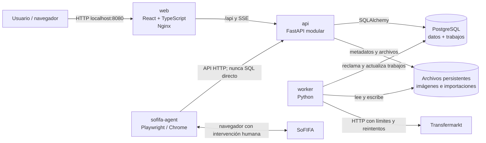

# ADR 0001: Arquitectura objetivo

- Estado: aceptada
- Fecha: 2026-08-24
- Issue: [#2 - Documentar la arquitectura objetivo](https://github.com/LeoFolino/LigaDeFutbol/issues/2)
- Decisores: equipo de LigaDeFutbol

## Contexto

La aplicación actual combina interfaz estática, rutas HTTP, reglas de negocio,
acceso directo a SQLite y tareas largas en un único proceso FastAPI. Este diseño
permitió validar el producto, pero dificulta probar, evolucionar y recuperar las
operaciones de importación y actualización cuando el proceso se interrumpe.

La arquitectura objetivo debe conservar Equipos, Base global y Calculadora,
permitir una migración incremental y funcionar de forma sencilla en una
computadora de desarrollo. También debe contemplar que SoFIFA puede requerir
intervención humana y que Transfermarkt necesita límites, demoras y reintentos.

## Decisión

Se mantendrá un **monorepo** con cuatro procesos desplegables y PostgreSQL:

1. `web`: React, TypeScript y Vite; Nginx sirve la compilación de producción.
2. `api`: FastAPI modular; expone HTTP/JSON y eventos SSE.
3. `worker`: proceso Python independiente para trabajos durables en segundo
   plano.
4. `sofifa-agent`: agente Python interactivo ejecutado en la máquina del
   usuario cuando sea necesario; no forma parte obligatoria de Docker Compose.
5. `db`: PostgreSQL como fuente de verdad.

Docker Compose será el mecanismo de ejecución y operación local. No se usará
Kubernetes en esta etapa.

## Diagrama de componentes



En desarrollo, Vite puede ejecutarse en `localhost:5173` y comunicarse con la
API en `localhost:8000`. En el stack completo, el navegador utiliza únicamente
`localhost:8080`; Nginx entrega React y redirige `/api` al servicio `api:8000`.

## Estructura del monorepo

La estructura objetivo será:

```text
LigaDeFutbol/
├── apps/
│   ├── web/                 # React, TypeScript y Vite
│   ├── api/                 # punto de entrada FastAPI
│   ├── worker/              # punto de entrada del worker
│   └── sofifa-agent/        # agente interactivo y scripts de Playwright
├── backend/
│   ├── api/routers/         # transporte HTTP y validación de entrada
│   ├── modules/
│   │   ├── players/
│   │   ├── teams/
│   │   ├── calculator/
│   │   └── scans/
│   ├── services/            # casos de uso y reglas de negocio
│   ├── repositories/        # contratos y persistencia SQLAlchemy
│   ├── db/                  # modelos, sesión y migraciones Alembic
│   └── integrations/        # CSV, SoFIFA y Transfermarkt
├── tests/                   # pruebas unitarias, integración y regresión
├── infra/                   # Dockerfiles, Nginx y scripts operativos
├── docs/                    # ADR y guías
└── compose.yaml
```

La adopción será incremental. Los nombres podrán ajustarse durante la
migración, pero se conservarán estos límites: presentación, transporte HTTP,
casos de uso, persistencia e integraciones externas no se mezclarán.

## Responsabilidades

### Frontend (`web`)

- Renderizar Equipos, Base global y Calculadora.
- Mantener el estado de interfaz y validaciones de experiencia de usuario.
- Consumir un cliente HTTP centralizado contra `/api/v1`.
- Mostrar progreso de trabajos mediante Server-Sent Events (SSE), con consulta
  periódica como recuperación si se pierde la conexión.
- Mantener la Calculadora como simulación separada de las asignaciones reales.
- No contener reglas de persistencia ni conectarse directamente a PostgreSQL.

### API (`api`)

- Autenticar y validar solicitudes cuando se incorpore autenticación.
- Exponer contratos versionados bajo `/api/v1` y documentarlos con OpenAPI.
- Ejecutar casos de uso cortos de jugadores, equipos y asignaciones.
- Crear, consultar y cancelar trabajos; las operaciones largas responden
  `202 Accepted`.
- Publicar progreso por SSE desde el estado durable de los trabajos.
- Acceder a datos únicamente mediante servicios y repositorios SQLAlchemy.
- No ejecutar scraping, navegadores ni importaciones largas dentro de una
  petición HTTP.

### Worker (`worker`)

- Reclamar trabajos `queued` desde PostgreSQL y ejecutarlos fuera de la API.
- Procesar actualizaciones de Transfermarkt, importaciones CSV, auditorías y
  descarga de imágenes.
- Registrar progreso, intentos, errores y fechas por cada elemento del trabajo.
- Aplicar límites de concurrencia, demoras, reintentos con backoff y cancelación
  cooperativa.
- Recuperar trabajos interrumpidos y realizar un apagado seguro.
- Emitir logs estructurados con identificadores de trabajo y jugador.

API y worker compartirán servicios, modelos y repositorios del paquete
`backend`, pero tendrán puntos de entrada y ciclos de vida independientes.

### Agente interactivo de SoFIFA (`sofifa-agent`)

- Ejecutar Playwright con el perfil persistente del usuario o conectarse a
  Chrome mediante CDP.
- Solicitar trabajo y publicar progreso/resultados por la API.
- Marcar el trabajo `waiting_user` cuando haya una verificación que requiera
  intervención humana.
- Reanudar el trabajo después de la intervención o de un reinicio.
- No acceder directamente a PostgreSQL ni intentar eludir verificaciones del
  sitio.

## Datos y trabajos durables

PostgreSQL será la fuente de verdad para jugadores, equipos, asignaciones,
importaciones y trabajos. SQLAlchemy desacoplará los repositorios del motor y
Alembic administrará el esquema.

La transición conservará compatibilidad temporal con SQLite hasta completar la
migración y verificar conteos, claves y relaciones. Después de esa validación,
SQLite quedará solo como fuente histórica o de importación, no como base activa.

Los trabajos usarán como mínimo:

- `scan_jobs`: tipo, estado, parámetros, progreso agregado, intentos y marcas
  de tiempo.
- `scan_job_items`: jugador o elemento, estado, resultado, error, intentos y
  marcas de tiempo.

Estados permitidos:

```text
queued -> running -> completed
                  -> failed
                  -> cancelled
                  -> waiting_user -> running
```

El worker reclamará trabajos de forma atómica. PostgreSQL permitirá usar
bloqueo de filas, por ejemplo `FOR UPDATE SKIP LOCKED`, para evitar que dos
workers ejecuten el mismo elemento. No se añadirá Redis mientras PostgreSQL
cubra correctamente la durabilidad y concurrencia requeridas.

## Estrategia para fuentes externas

### Transfermarkt

- Las actualizaciones individuales o por lote se convierten en trabajos.
- El worker realiza las solicitudes con `User-Agent` explícito, timeout,
  límites de concurrencia, demora configurable y backoff.
- Se registra el resultado de validación de nombre, la fecha de consulta y el
  error del último intento.
- Los fallos parciales no revierten elementos ya completados y pueden
  reintentarse de forma idempotente.
- La API nunca espera a que termine un lote: devuelve el identificador del
  trabajo con estado HTTP 202.

### SoFIFA

- Se conserva el flujo con navegador real porque puede requerir sesión y
  verificación humana.
- El agente funciona en Windows/Git Bash y macOS, usando un perfil persistente
  o una conexión CDP a Chrome.
- El agente obtiene y actualiza trabajos exclusivamente mediante la API.
- Cuando el sitio exige intervención, el agente conserva el progreso y cambia
  el estado a `waiting_user`; no intenta saltar la verificación.
- Las versiones, URL de origen, fecha y resultado quedan auditados por jugador.

Ambas integraciones estarán detrás de interfaces propias. Los cambios de HTML,
red, límites o disponibilidad no deben modificar routers ni reglas de dominio.

## Comunicación

| Origen | Destino | Protocolo | Uso |
| --- | --- | --- | --- |
| Navegador | `web` | HTTP `localhost:8080` | interfaz de producción local |
| Navegador | Vite | HTTP `localhost:5173` | desarrollo del frontend |
| `web`/Vite | `api` | HTTP/JSON y SSE | `/api/v1`, progreso en vivo |
| `api` | `db` | PostgreSQL/TCP | operaciones transaccionales |
| `worker` | `db` | PostgreSQL/TCP | reclamar y actualizar trabajos |
| `api`/`worker` | archivos | sistema de archivos | imágenes e importaciones |
| `sofifa-agent` | `api` | HTTP/JSON | trabajo, progreso y resultados |
| `worker` | Transfermarkt | HTTPS | consulta controlada de datos |
| `sofifa-agent` | SoFIFA | HTTPS/Playwright | navegación interactiva |

No existe comunicación directa entre frontend y base de datos, ni entre el
agente SoFIFA y PostgreSQL. Los nombres DNS `api`, `worker` y `db` solo existen
en la red interna de Compose.

## Puertos y exposición

| Servicio | Puerto interno | Puerto del host | Política |
| --- | ---: | ---: | --- |
| `web` | 80 | `127.0.0.1:8080` | único acceso del stack completo |
| `api` | 8000 | `127.0.0.1:8000` opcional | expuesto solo en perfil de desarrollo |
| Vite | 5173 | `127.0.0.1:5173` | solo desarrollo |
| `db` | 5432 | ninguno por defecto | acceso solo desde la red de Compose |
| `worker` | ninguno | ninguno | proceso saliente, sin servidor público |
| `sofifa-agent` | ninguno | ninguno | cliente local de la API |

Si se necesita inspeccionar PostgreSQL desde el host, un override de desarrollo
podrá publicar `127.0.0.1:5432:5432`. Nunca se enlazará la base a `0.0.0.0` por
defecto.

## Volúmenes

| Volumen | Consumidores | Contenido | Respaldo |
| --- | --- | --- | --- |
| `postgres_data` | `db` | datos PostgreSQL | `pg_dump` y restauración probada |
| `app_files` | `api`, `worker` | imágenes y archivos importados | copia de archivos con checksum |
| perfil Playwright del host | `sofifa-agent` | sesión del navegador | local, fuera de imágenes y de Git |

Los contenedores serán reemplazables: ningún dato importante residirá
únicamente en su capa escribible. Los secretos y perfiles de navegador no se
incluirán en imágenes ni volúmenes compartidos innecesariamente.

## Configuración y salud

- `.env` configura URLs, credenciales, límites y demoras; `.env.example`
  documenta las claves sin secretos.
- `DATABASE_URL` será obligatorio para API, worker y migraciones.
- `web` dependerá del health check de `api`; `api` y `worker` esperarán el
  health check de `db`.
- La API expondrá un endpoint de salud que distinga proceso vivo de acceso
  correcto a dependencias.
- Los logs se escribirán a stdout/stderr para consultarlos con
  `docker compose logs`.
- Las imágenes se construirán con dependencias fijadas y procesos sin
  privilegios cuando sea posible.

## Docker Compose

El stack obligatorio tendrá los servicios `web`, `api`, `worker` y `db` en una
red privada. `docker compose up --build` deberá dejar la aplicación disponible
en `http://localhost:8080`.

El agente SoFIFA queda fuera del arranque obligatorio porque necesita acceso al
navegador y, en ocasiones, a la interacción del usuario. Se ejecutará desde el
host contra la API; opcionalmente podrá existir un perfil Compose para entornos
que soporten correctamente la interfaz gráfica, sin convertirlo en dependencia
del stack principal.

## Decisión de no usar Kubernetes

No se utilizará Kubernetes en esta etapa porque el objetivo de despliegue es
una computadora local o un único host, con cuatro servicios y sin requisitos
actuales de alta disponibilidad, autoescalado o operación multi-nodo.

Kubernetes añadiría manifiestos, ingress, gestión de secretos, almacenamiento,
observabilidad y procedimientos operativos que no resuelven una necesidad
actual del producto. Docker Compose ofrece aislamiento, health checks,
persistencia y un comando único de arranque con menor costo operativo.

La decisión podrá revisarse si aparecen requisitos medibles de múltiples hosts,
alta disponibilidad, escalado independiente sostenido o una plataforma
organizacional que ya opere Kubernetes. La existencia de más datos o más
trabajos, por sí sola, no obliga a cambiar de orquestador.

## Seguridad y límites operativos

- Solo `web` se expone por defecto y todos los puertos se enlazan a localhost.
- PostgreSQL no se publica fuera de la red interna salvo override explícito.
- Las credenciales no se versionan ni se incorporan a las imágenes.
- Los archivos subidos se validan por tamaño, extensión y contenido esperado.
- Worker y agente respetan timeouts, límites y condiciones de los sitios
  externos; no eluden controles de acceso o verificaciones humanas.
- Las escrituras de resultados serán idempotentes para tolerar reintentos.

## Migración incremental

1. Proteger el comportamiento actual con pruebas de regresión.
2. Modularizar FastAPI sin cambiar endpoints ni respuestas existentes.
3. Introducir SQLAlchemy, modelos y Alembic con compatibilidad temporal SQLite.
4. Levantar PostgreSQL y migrar/verificar los datos.
5. Incorporar trabajos durables, API de escaneos y worker.
6. Mover Transfermarkt, CSV, auditorías e imágenes al worker.
7. Adaptar el agente interactivo de SoFIFA.
8. Crear React/TypeScript y migrar cada vista de forma gradual.
9. Contenerizar los procesos y completar Docker Compose.
10. Añadir backups, observabilidad y procedimientos de recuperación.

Durante la transición se mantendrán los contratos existentes hasta que el
frontend React cubra las mismas funciones. El código anterior se eliminará
solamente después de comprobar la equivalencia y evitar implementaciones
duplicadas.

## Consecuencias

### Positivas

- API y tareas largas dejan de bloquearse entre sí.
- Los trabajos sobreviven reinicios y ofrecen progreso auditable.
- Los límites entre interfaz, dominio, persistencia e integraciones permiten
  pruebas y cambios independientes.
- Un único repositorio mantiene coordinados contratos, migraciones e
  infraestructura.
- Docker Compose conserva una operación local simple y reproducible.

### Costos y riesgos

- Se incorporan Node.js, PostgreSQL, SQLAlchemy, Alembic, Nginx y contenedores.
- La migración exige mantener compatibilidad temporal y pruebas de regresión.
- PostgreSQL funciona como datos y cola, por lo que deben diseñarse bien el
  bloqueo, los reintentos y la limpieza de trabajos.
- Las integraciones externas seguirán dependiendo de cambios y límites de
  terceros; el aislamiento reduce el impacto, pero no elimina esa dependencia.

## Criterios de revisión de esta ADR

La decisión se revisará si cambia el objetivo de despliegue, si PostgreSQL deja
de cubrir el volumen de trabajos o si aparecen requisitos reales de alta
disponibilidad o escalado horizontal. Cualquier cambio deberá registrarse en
una ADR nueva que reemplace explícitamente esta decisión.
